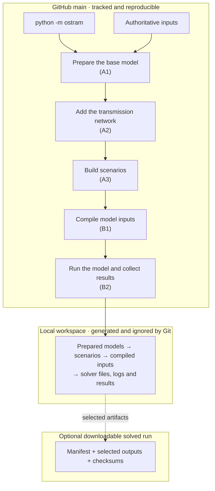

# Pipeline



GitHub `main` contains the maintained, reproducible source and authoritative
inputs. Generated inputs, solver files, logs, and results belong in the ignored
local workspace. An optional downloadable solved run is a distinct later
concern; OSTRAM does not build the `RELEASE` box in the current workflow.

Run it with:

```powershell
python -m ostram run [options]
```

## Run terminal and detailed log

An interactive terminal shows a compact live status on stderr for all five
stages, including the active scenario where available, elapsed time, recent
status, and completed, failed, or skipped state. Redirected output uses stable
append-only status lines without cursor-control sequences. `--verbose` disables
the moving display and streams complete child stdout/stderr plus tokenized
command and working-directory diagnostics.

Every actual run writes a UTF-8 log to:

```text
<workspace>/logs/<run-id>/run.log
```

The log records run and stage timing, selected scenarios, child commands and
working directories, complete child output, child exit codes, interruptions or
exceptions, the final outcome, and the final process exit code. Help, malformed
arguments, imports, and `inspect-resources` do not create a workspace or log.
Terminal text safely degrades when the active stream encoding cannot represent
a path or character; the detailed log retains the original Unicode.

## Prepare the base model (A1) and add the transmission network (A2)

A1 reads the maintained CSV authorities in `inputs/osemosys_global/`, the
preparation configuration in `config/preparation/`, and workbook assets in
`inputs/preparation/`. A2 adds the governed transmission content. Their mutable
products and post-A2 snapshots live under `<workspace>/preparation/`.

The full runner treats A1+A2 as a pair. If every selected root already has its
post-A2 snapshot, the pair is skipped; otherwise the root preparation is
rebuilt before A3.

## Build selected scenarios (A3)

The maintained authorities are:

- `inputs/scenarios/OSTRAM_Scenario_Inputs.xlsx`
- `inputs/scenarios/OSTRAM_Timeslice_Inputs.xlsx`
- `config/scenarios/registry.json`
- scenario-specific rule YAML/JSON files in `config/scenarios/<scenario>/`

The registry declares four roots and the accepted derived scenarios. A root is
transformed through the ordered workbook stages. A derived scenario begins
from its declared root output and then receives only its registered patch and
optional direction overlay.

Focused root transformation uses:

```powershell
python -m ostram transform --scenario BAU
```

Temporary stage directories are created under `<workspace>/scenarios/` and are
removed unless `--keep-workdir` is set. Python implementation files are never
copied into those directories; subprocess stages execute installed package
modules with explicit workspace and project paths. Ephemeral Stage-3 workbook
names are deterministic inside the unique run directory. If a desired absolute
workbook path would reach 240 UTF-16 code units, the filename is compacted to
its final semantic stage plus a short digest; the `.xlsx` extension and the
actual returned path are preserved for downstream stages. A workspace parent
that cannot hold even the compact name fails before workbook transformation.

## Compile model inputs (B1)

B1 consumes the explicit trajectories already present in the current scenario
workbooks. It does not load the retired `A-Xtra_Projections.xlsx` transport
assumption workbook or the retired, unused
`A-Xtra_Battery_Replacement.xlsx` workbook. Legacy GDP-demand or numeric
transport-distance projection modes fail closed instead of restoring or
substituting retired numerical authority. Emissions and Storage remain required
extra inputs generated by A1 from maintained workbook templates.

B1 reads materialized scenario workbooks, copies the maintained compiler YAML
into `<workspace>/compilation/`, updates the selected scenario in that runtime
copy, and writes compiled parameter CSVs under
`<workspace>/compilation/A2_Output_Params/`.

```powershell
python -m ostram compile-inputs
python -m ostram compile-inputs --scenarios "BAU,B_Optimised_VRE"
```

The maintained `config/compilation/Config_MOMF_T1_A.yaml` is not mutated.

## Run the model and collect results (B2)

B2 reads:

- `config/execution/Config_MOMF_T1_AB.yaml`
- `model/osemosys_fast_preprocessed.txt`
- `ostram/resources/compilation/conversion_format.yaml`
- compiled scenario CSVs from the selected workspace

It writes preprocessed text, optional solver artifacts, and result tables only
under `<workspace>/execution/` (apart from the documented root datafile export
when enabled).

The solver-free boundary is:

```powershell
python -m ostram run --skip-pull --compile-only
```

This route stops before matrix creation, solver adapters, cleanup, and result
post-processing. A normal `python -m ostram run` follows the solver and policy
settings in the execution YAML.

## Scenario selection

`--scenarios` accepts a comma-separated exact selection. The registry validates
names, preserves canonical order, calculates required roots, and resolves
declared result dependencies. `C_Target_VRE` requires the accepted A-result
seed boundary; no result is discovered through caller CWD.

## Path and process guarantees

- Project and workspace selection follow CLI > environment > editable checkout.
- Every resource and runtime path is absolute after resolution.
- Resource inspection never creates the workspace.
- Production code has no `sys.path` manipulation or global `chdir`.
- Python subprocess stages use `python -B -m <package.module>`.
- Commands use token lists, never `shell=True`.
- Package resources are opened read-only from the installed package.

See [configuration](configuration.md) for parameter details and
[lineage](lineage.md) for source ownership.
