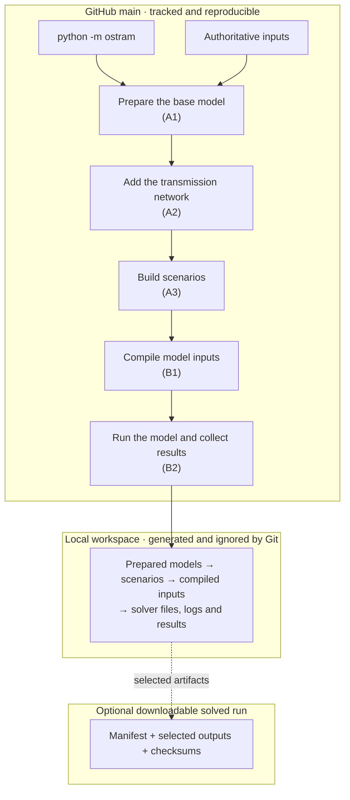

# Pipeline



GitHub `main` contains the maintained, reproducible source and authoritative
inputs. Generated inputs, solver files, logs, and results belong in the ignored
local workspace. An optional downloadable solved run is a distinct later
concern; OSTRAM does not build the `RELEASE` box in the current workflow.

Run it with:

```powershell
python -m ostram run [options]
```

## Run terminal and detailed log

An interactive terminal shows a compact live status on stderr for all five
stages, including the active scenario where available, elapsed time, recent
status, and completed, failed, or skipped state. Redirected output uses stable
append-only status lines without cursor-control sequences. `--verbose` disables
the moving display and streams complete child stdout/stderr plus tokenized
command and working-directory diagnostics.

Every actual run writes a UTF-8 log to:

```text
<workspace>/logs/<run-id>/run.log
```

The log records run and stage timing, selected scenarios, child commands and
working directories, complete child output, child exit codes, interruptions or
exceptions, the final outcome, and the final process exit code. Help, malformed
arguments, imports, and `inspect-resources` do not create a workspace or log.
Terminal text safely degrades when the active stream encoding cannot represent
a path or character; the detailed log retains the original Unicode.

## Prepare the base model (A1) and add the transmission network (A2)

A1 reads the maintained CSV authorities in `inputs/osemosys_global/`, the
preparation configuration in `config/preparation/`, and workbook assets in
`inputs/preparation/`. A2 adds the governed transmission content. Their mutable
products and post-A2 snapshots live under `<workspace>/preparation/`.

The full runner treats A1+A2 as a pair. If every selected root already has its
post-A2 snapshot, the pair is skipped; otherwise the root preparation is
rebuilt before A3.

## Build selected scenarios (A3)

The maintained authorities are:

- `inputs/scenarios/OSTRAM_Scenario_Inputs.xlsx`
- `inputs/scenarios/OSTRAM_Timeslice_Inputs.xlsx`
- `config/profiles/full.yaml::scenario_registry`
- scenario-specific rule YAML files in `config/scenarios/<scenario>/`

Full-profile derived edits live in `config/profiles/full.yaml`; the former
scenario JSON input files are retired. Profile-selection JSON, timeslice
metadata, and generated change/materialization/reporting JSON remain legitimate
configuration and provenance records.

The registry declares four roots and the accepted derived scenarios. A root is
transformed through the ordered workbook stages. A derived scenario begins
from its declared root output and then receives only its registered patch and
optional direction overlay.

Focused root transformation uses:

```powershell
python -m ostram transform --scenario A_Calibrated_BAU
```

Temporary stage directories are created under `<workspace>/scenarios/` and are
removed unless `--keep-workdir` is set. Python implementation files are never
copied into those directories; subprocess stages execute installed package
modules with explicit workspace and project paths. Ephemeral Stage-3 workbook
names are deterministic inside the unique run directory. If a desired absolute
workbook path would reach 240 UTF-16 code units, the filename is compacted to
its final semantic stage plus a short digest; the `.xlsx` extension and the
actual returned path are preserved for downstream stages. A workspace parent
that cannot hold even the compact name fails before workbook transformation.

## Compile model inputs (B1)

B1 consumes the explicit trajectories already present in the current scenario
workbooks. It does not load the retired `A-Xtra_Projections.xlsx` transport
assumption workbook or the retired, unused
`A-Xtra_Battery_Replacement.xlsx` workbook. Legacy GDP-demand or numeric
transport-distance projection modes fail closed instead of restoring or
substituting retired numerical authority. Emissions and Storage remain required
extra inputs generated by A1 from maintained workbook templates.

B1 reads materialized scenario workbooks, copies the maintained compiler YAML
into `<workspace>/compilation/`, updates the selected scenario in that runtime
copy, and writes compiled parameter CSVs under
`<workspace>/compilation/A2_Output_Params/`.

```powershell
python -m ostram compile-inputs --scenarios A_Calibrated_BAU
python -m ostram compile-inputs --scenarios "A_Calibrated_BAU,B_Optimised_VRE"
```

The maintained `config/compilation/Config_MOMF_T1_A.yaml` is not mutated.

## Run the model and collect results (B2)

B2 reads:

- `config/execution/Config_MOMF_T1_AB.yaml`
- `model/osemosys_fast_preprocessed.txt`
- `ostram/resources/compilation/conversion_format.yaml`
- compiled scenario CSVs from the selected workspace

It writes preprocessed text, optional solver artifacts, and result tables only
under `<workspace>/execution/` (apart from the documented root datafile export
when enabled).

The solver-free boundary is:

```powershell
python -m ostram run --skip-pull --compile-only --scenarios A_Calibrated_BAU
```

This route stops before matrix creation, solver adapters, cleanup, and result
post-processing. A normal `python -m ostram run` follows the solver and policy
settings in the execution YAML.

### Result layout and concatenation

Each scenario owns its otoole result tables at
`<workspace>/execution/Executables/<scenario>_0/Outputs/`. The directory is
anchored to the scenario regardless of whether `outputs` is configured as a bare
name or an absolute workspace path, so a serial multi-scenario run keeps every
scenario's results instead of overwriting them.

`concat_otoole_csv` writes that scenario's own combined table and feeds cost
verification, including `TotalDiscountedCost.csv`.

`concat_scenarios_csv` writes the cross-scenario combined CSVs. It runs **once
per run invocation**, in the final post-processing stage, after the last
scenario of the selection. Because it rereads every scenario present in
`Executables/`, its cost grows with the number of scenarios already on disk —
so, after completing A, pass the remaining selection to one invocation:

```powershell
python -m ostram --workspace $workspace run --skip-pull --scenarios "B_Optimised_VRE,C_Target_VRE" --a-result-seed $aResult
```

Driving a campaign as one invocation per scenario instead makes B2 — and
therefore this concatenation — run once per scenario, which is quadratic in the
selection size. A 15-scenario campaign measured the phase growing from 183.5 s
to 754.5 s per invocation. Split invocations only when a run genuinely needs a
seam between scenarios, and expect that cost.

## Scenario selection

`--scenarios` accepts a comma-separated exact selection. The registry validates
names, preserves canonical order, calculates required roots, and resolves
declared result dependencies. `C_Target_VRE` requires the accepted A-result
seed boundary; no result is discovered through caller CWD.

### Support BAU

The owner-authorized full-profile rule is: **BAU permits existing transmission
plus already committed additions, with no discretionary expansion beyond those
commitments.** Existing `TotalAnnualMinCapacityInvestment` values for the 18
interconnector `TRN` technologies are interpreted as the commitments. Their
year is their commissioning year. No investment minimum is removed or changed.

For technology `t` and model year `y`, the final ceiling is:

```text
TotalAnnualMaxCapacity[t,y] = ResidualCapacity[t,y]
  + sum(TotalAnnualMinCapacityInvestment[t,v]
        for model years v where 0 <= y-v < OperationalLife[t])
```

This uses the model's vintage survival rule: a committed addition is unavailable
before commissioning and expires at the operational-life boundary. Residual
capacity keeps its existing year-by-year trajectory. With the unchanged annual
investment minima, the ceiling prevents discretionary additions. The previous
residual-only ceiling caused 156 V2 conflicts with required additions.

The policy runs **only on the final full-profile `BAU` output**, after disposable
restriction-state export and delivery. Shared preparation, post-A2 snapshots,
and inherited Restrictions retain their existing values. Accepted A and the
other 16 decision scenarios therefore retain their modelling contract. The
UNESCAP profile does not enable this policy. Validation remains enabled and
does not apply repairs. `support_bau_transmission.json` beside the final
parametrization workbook records all 504 technology/year ceilings and sources.

After the [clean-clone installation](installation.md#clean-clone-support-bau),
run this in the activated `ostram-pr35` environment from the checkout:

```powershell
$workspace = [IO.Path]::GetFullPath('..\support-bau-workspace')
if (Test-Path -LiteralPath $workspace) { throw 'Choose a new empty workspace path' }
python -m ostram --profile full --workspace $workspace run --env-name ostram-pr35 --skip-pull --scenarios BAU --verbose
if ($LASTEXITCODE -ne 0) { throw 'Support BAU preparation/compilation/solve/export failed' }
```

This performs A1, A2, A3, B1, B2, export and cost reconciliation from maintained
checkout inputs, without an A-result seed. Keep the workspace logs and
`execution/Executables/BAU_0` contents, including the CPLEX log/solution and
`*_cost_reconciliation.json`. Check optimal status, primal/dual feasibility,
transmission capacity against the commitment audit, and backstop activity.
Support `BAU` is a separate case; it is neither `A_Calibrated_BAU` nor a member
of the accepted 17-case portfolio. A full portfolio run still needs the A-first
sequence below.

### Accepted 17-scenario portfolio

The full-profile registry distinguishes support `BAU` from the 17 decision
scenarios. `A_Calibrated_BAU` is the accepted A case. A1, A2, A3, B1 and B2
name stages; B1 does not mean `B_Optimised_VRE`.

Support BAU has its own [committed-transmission policy and execution command](#support-bau).
Selecting A applies its existing declared transformations and preserves BAU
restriction inheritance. The accepted portfolio does not require a BAU solve.

Use an empty, local workspace and an editable installation of this checkout.
The runner's default selection includes support BAU, and its single A3 pass
does not solve A before materializing C. Select the decision cases explicitly
and complete A first. These two invocations use only maintained checkout inputs
and the newly solved A; no accepted or private prepared inputs are copied in.

```powershell
$workspace = [IO.Path]::GetFullPath('..\w')
if (Test-Path -LiteralPath $workspace) { throw 'Choose a new empty workspace path' }
python -m ostram --workspace $workspace run --skip-pull --scenarios A_Calibrated_BAU --verbose
if ($LASTEXITCODE -ne 0) { throw 'A preparation/compilation/solve/export failed' }

$remaining = python -c "from ostram.pipeline.scenarios.registry import load_registry; r=load_registry(); assert len(r.decision_scenarios)==17; print(','.join(n for n in r.decision_scenarios if n!='A_Calibrated_BAU'))"
if ($LASTEXITCODE -ne 0) { throw 'Cannot resolve the accepted scenario selection' }
$aResult = Join-Path $workspace 'execution\Executables\A_Calibrated_BAU_0'
python -m ostram --workspace $workspace run --skip-pull --scenarios $remaining --a-result-seed $aResult --verbose
if ($LASTEXITCODE -ne 0) { throw 'Remaining portfolio failed' }
```

If the isolated Conda environment has a different name, add
`--env-name <name>` to **both** `run` invocations. Confirm A's solver status and
feasibility before allowing dependent materialization; an output file's
existence alone is not evidence of an accepted solve. `--compile-only` cannot
create this result dependency. For a solver-free single-case preparation check,
use `run --skip-pull --compile-only --scenarios A_Calibrated_BAU` in another
workspace. A selected external A seed is appropriate only for an explicitly
declared comparison exercise, not a fresh full solve.

The normal B2 route exports each scenario's otoole tables and reconciles costs
in its concatenated output with adjacent reconciliation evidence. Keep the raw
tables, compiled data, LP, solution, solver log and reconciliation JSON together.
Select historical comparisons from `selected_portfolio.csv` and
`selected_solver_chain.csv`, never by modification time. In the September 2026
release, TradeCap15 selects recovery `r/11` with its matching parent inputs;
the original status-5 solution is not the accepted baseline. Recovery used
numerical emphasis on the same LP with feasibility/optimality tolerances of
`1e-6`, without changing model coefficients.

`config/execution/Config_MOMF_T1_AB.yaml` now selects that numerical emphasis
for `B_Opt_TradeCap15` through `cplex_numerical_emphasis_scenarios`. B2 applies
the recorded recovery settings before optimization and prints the changed
CPLEX settings. The selection is local to that solve; other scenarios retain
their original commands. This makes the accepted recovery reproducible through
the normal export/reconciliation chain without an external solver wrapper or
an LP edit. Always check the final solver status and certificate; a successful
process exit alone does not establish feasibility.

### Compare a reproduced portfolio

Keep comparison evidence outside the checkout and production workspace. Use
the explicit selected portfolio and solver-chain records to pair all 17 cases.
Compare compiled data and LP hashes exactly, and compare effective parameter
values, defaults and sets independently. Require CPLEX optimal status 1,
primal/dual feasibility, and maximum primal/dual infeasibility at most `1e-6`.
For objective and reconciled cost, the reproduction uses
`abs(fresh - accepted) <= 1e-6 + 1e-10 * abs(accepted)` MUSD, a small allowance
for floating-point summation roundoff.

Compare every raw exported CSV. Byte-identical files establish exact physical
output equality; any different table remains unresolved until its differences
are examined. Equal objectives alone do not establish an acceptable alternative
optimum. A complete solution-XML comparison may normalize line endings and
exclude only the `problemName` path attribute. Keep per-case source paths,
hashes, solver certificates, objective/cost deltas and reconciliation JSON with
the comparison record. Wait for the runner's final cross-scenario
post-processing and successful exit before declaring the workflow complete.

## Path and process guarantees

- Project and workspace selection follow CLI > environment > editable checkout.
- Every resource and runtime path is absolute after resolution.
- Resource inspection never creates the workspace.
- Production code has no `sys.path` manipulation or global `chdir`.
- Python subprocess stages use `python -B -m <package.module>`.
- Commands use token lists, never `shell=True`.
- Package resources are opened read-only from the installed package.

See [configuration](configuration.md) for parameter details and
[lineage](lineage.md) for source ownership.
